# Ghadames - Project Portfolio 1


## Table of contents
 
1. [Site Overview](#site-overview)

    +  [User Stories](#user-stories)

    + [Site Goals](#site-goals)

1. [Design](#design)
   
   + [Colours](#colours)

   + [Typography](#typography)

   + [Imagery](#Imagery)

1. [Features](#features)

    +  [Header](#header)

    + [Navigation Bar](#navigation-bar)

    + [Home page](#home-page)

    + [Footer](#footer)

    + [About](#about)

    + [Gallery](#gallery)

    + [Contact](#contact)

1. [Future Features](#future-features)  

1. [Used Technologies](#used-technologies)

   + [Languages](#languages)
   
   + [Other Technologies](#other-technologies)

1. [Testing and Validator](#testing-and-validator)
   
   + [Code Validation](#code-validation)

   + [Test Cases](#test-cases)

1. [Bugs and fixing](#bugs-and-fixing)
   
   + [Fixed Bugs](#fixed-bugs)
  
1. [Deployment](#deployment)
  
   + [Via Gitpod](#via-gitpod)

   + [Via GitHub Pages](#via-github-pages)

1. [Credits](#credits)
   
   + [Content and Media](#content-and-media)

   + [Acknowledgements](#acknowledgements)

------

## 1. Site Overview

 This site provides historic information about **Ghadames**, _The one of the oldest pre-Saharan cities_, known as ''**the pearl of the desert**''. And about **The old town** of Ghadames which has been declared in *1986* as a [UNESCO World Heritage site](https://whc.unesco.org/en/list/)</a>. 


#### [click here to view the site](https://amal-bb.github.io/Ghadames/)


+ ### **User Stories**


  As a *visiting user*, I would like to:
    
     * Easily understand what the site is about and learn more about the city. 

     * Easily navigate throughout the site to find the information.
    
     * Get knowledge of the most valuable information about Ghadames and its heritage town.  

     * View a city gallery containing a short video and clear images.

     * Find all upcoming events dates and locations.

     * See the location of the city on google map.

     * find social media links.

     * Contact the site owner to get help for arranging my visit to the city or for any other inquiries.


+ ### **Site Goals**

     * Introduce Ghadames, its civilization, and its heritage. 

    * Show the historic information about Ghadames and the old town in an interesting way.

    * Provide users who are interesting to visit the city with important info related to a city location, culture, and weather. 
    
    * keep users up to date with any upcoming events for Ghadames.

    * Help users to plan their visit through a contact page.

    * Display a gallery of the most attractive places in the city that users can enjoy while visiting.

----
## 2. Design

+ ### **Colours**

    

    * Colours schema of gray and red has been used.

+ ### **Typography**

   * [**Lato**](https://fonts.google.com/specimen/Lato#about) font is a sans serif typeface family, used throughout the whole website with Sans Serif as the fallback font in case of the font isn't being imported into the site correctly.

   * Serif has been used for the logo. 

   * Both fonts are clear, attractive and appropriate.

+ ### **Imagery**

   * The red color pattern is inspired by the traditional colors of Ghadames culture.
   
   * The subtitle of the city name logo is used to get user inquisitiveness to find out more about the city.
   
     
----

## 3. Features
  
The website has been designed to be responsive on all device sizes.

+ ### **Header**

    * The header situated on the top of each page has an attractive linear-gradient background color, contains the city logo on the left and the navigation bar on the right.

    * It sticks to the top of the page while scrolling down to make navigation easier for users.
  
    * The logo very simply shows the city name using clear font styled with a shadow, and it linked to the home page.

      

+ ### **Navigation Bar**

    * The navigation bar is clear and easy to use contains 4 links: Home, About, Gallery, and Contact.

    * The navigation bar will allow the user to easily navigate from page to page across all devices, as the navigation menu is changed to a burger menu in small screen size devices.

      
   
+ ### **Home page**

  The Home page has valuable content that should encourage a visiting user to navigate to other pages to know more about Ghadames. 

    *  _**Image section**_: has an attractive view photo for the old town of Ghadames (_the heritage site of the city_), with text overlay of short description to get user attention, and get his interesting to know more about the place.

     * _**Content section**_: contains a brief introduction of the most interesting information about Ghadames followed by three main headings with icons, including images and short descriptions.

       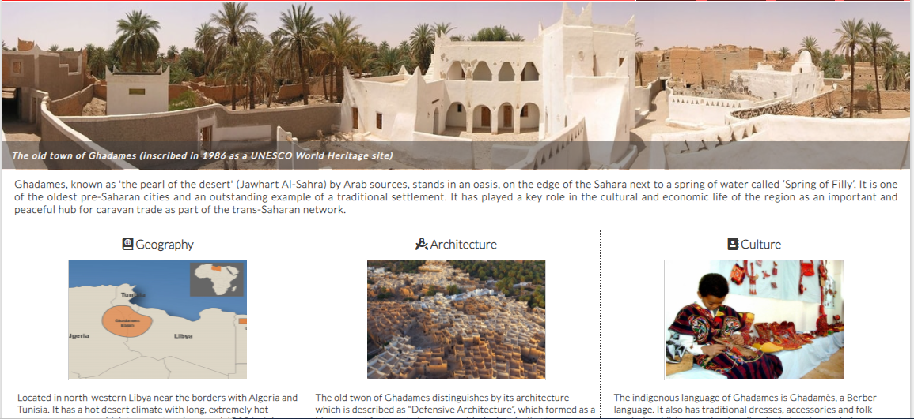

    * _**Event section**_: this section will allow the user to see the city event type, date, and location. It displays the event with a small image and will be updated to keep users up to date with upcoming events.

       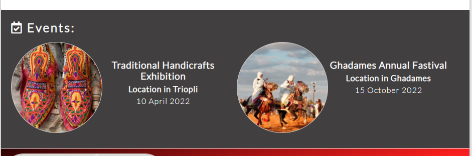

+ ### **Footer**
  
    * It has the same linear gradient background color of the header, and It includes an embedded Google Map for Ghadames location.

    * It contains icons direct to social media pages open in separate tabs, and another link to the contact page.

    * The footer is valuable to the user as it encourages him to get in contact to plan his visit.

      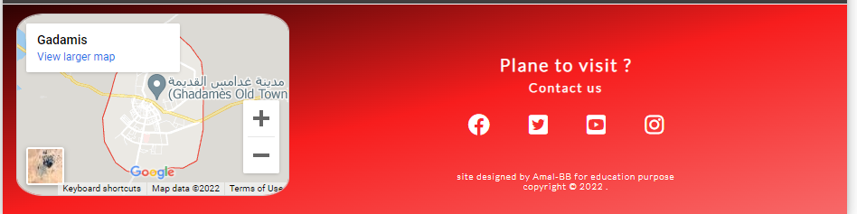

+ ### **About**

  * About page gives users more detailed information about Ghadames, divided into two headings, history and the old town, attached with images.

    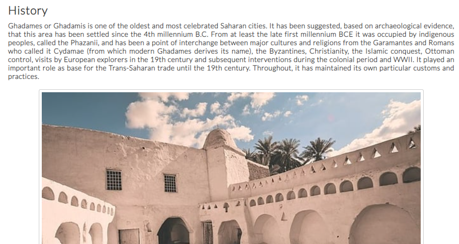

+ ### **Gallery**

  * This page provides the user with a short video showing the heritage places and describes the history of Ghadames, with supporting images of attractive places to visit.
  
  * This section will get the user excited to visit those places
    
    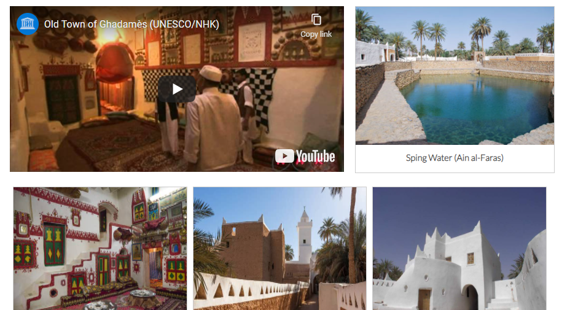

+ ### **Contact**

  * This page will allow the user to get in contact with the site owner. He can get help to plan his visit, or to get a response for his inquiries, as he will get a confirmation message on successful submission.

    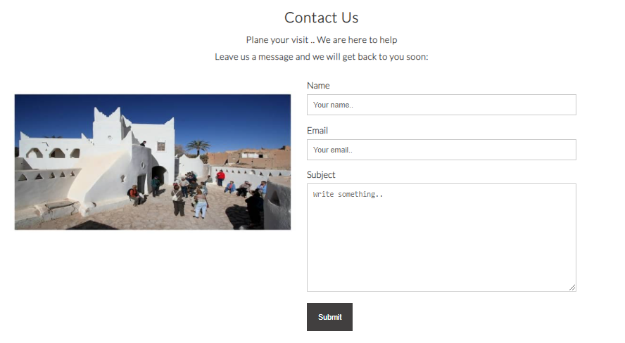

----

## 4. Future Features

   * I would use javascript to create an image slideshow instead of the main image on the Home page to make it more attractive and easily catch the user's attention.

   * I would add an Email subscribe option to keep users updated with city events. 

---

## 5. Used Technologies

+ ### **languages**

  * Only [Html5](https://en.wikipedia.org/wiki/HTML5) and [CSS3](https://en.wikipedia.org/wiki/CSS) languages are used in this project.


+ ### **Other Technologies**

  * [GitHub](https://github.com/) is used to store the project code and host the Website. 

  * [Techsini](http://techsini.com/multi-mockup/index.php) was used to generate The multi device mockup (_The image attatched here in readme_). 
   
  * [Toolur](https://compressimage.toolur.com) was used to compress the website images.

  * [Coolors](https://coolors.co/) was used to genetate colours palette , and [Contrast Grid](https://contrast-grid.eightshapes.com) was used to check the colours contrast.
 
  * [Google Font](https://developers.google.com/fonts) were used to import the used font into the style.css file.

  * [Font Awesome](https://kit.fontawesome.com) was used on all pages throughout the website to add icons.

----

 ## 6. Testing and Validtor

 * The responsive view for the site has been tested in a range of screen sizes via [Chrome DevTools](https://developer.chrome.com/docs/devtools/).

 * The website was tested on **Chrome**, **IE**, and **Firefox** browsers, also was shared with other users to get testing on a variety of devices such as: _Desktop, iPhon8, iPhone, iPhon12, Nokia 2.3, Huawei, Galaxy A12 and Tablet_.

 * The final testing result after solving bugs was the site has a responsive view and works fine with no issues reported.

+ ### **Code Validation**

   * No errors were returned for `Html Code` when passing through the offical [W3C Validator](https://validator.w3.org/).

   * No errors were returned for `CSS Code` when passing through the offical [Jigsaw Validator](https://jigsaw.w3.org/css-validator/). 

   * Project **Accessibility** has been checked through [Lighthouse](https://developers.google.com/web/tools/lighthouse) in Chrome DevTools, the result is shown below for both mobile and desktop.

     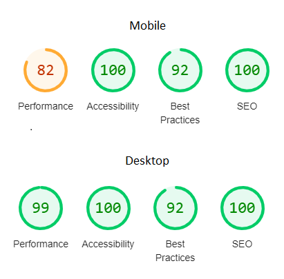


 + ### **Test Cases**

   * Upon entering the site, user are greeted with an easily readable navigation bar to go to the page of their choice.

   * If user entered the site by a mobile device then he can click on burger lines which will rotate and navigation bar will drop down, once he click again on burger lines then the navigation bar will disappear and buger lines will return to thier first position.

   * Home page
     * By entering the home page, the user will see an expressive photo about the heritage of the city with covered text, which lets him easily understand what the site is about.

     * By scrolling down, the user will get knowledge with valuable information about the city in a brief description followed by 3 headings having icons, along with images and short descriptions.

     * While moving down, the event section is showing the user _(event name, event image, location, and date)_. 

   * Footer
     * At the bottom of each page, there is a footer, where the user will see the city location in Google Maps, and once he clicks on _view larger map_ it will open the location on Google Maps in a new tab.

     * The user will be easily direct to the contact page from the footer once he clicks on highlighted _contact us_, or alternatively, he can contact the site owner on social media which highlights the links to him. 

   * About
     * By clicking about in the navigation bar, the user will be directed to the page, then he will notice history having detailed information along with the image, and under it, there is the old town having detailed information along with the image too.

   * Gallery  
     * By clicking gallery in the navigation bar, the user will be directed to the page, where he will find a short video runs once he click on it. 

     * Also he will see 7 images for many places he can visit.When the user click on any image, it will open in a new tab.

   * Contact 
     * The user can direct to the contact page through the navigation bar or the footer.

     * On this page, the user will find greeting words with an image showing tourism, also a contact form that requests him to fill his name and email with a choice to write the subject text and then submit it.  

     * In case the user press submit button without filling any of the required fields (Name or Email), then a warning message will appear in these fields, asking him to fill this field.

      > 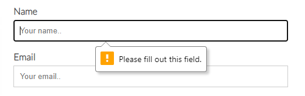
 
     * If the user fills the Name by one letter, or in case of typing an incorrect email another warning message will appear in this field.

       > 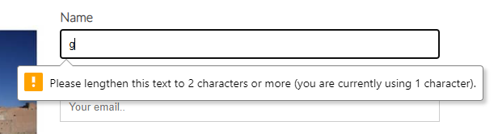
       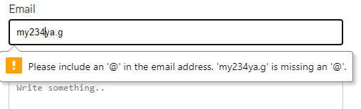
 
     * Once the user fills all required fields and then press submit button, he will get a confirmation message.

       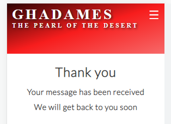


## 7. Bugs and Fixing

All reported bugs from testing has been fixed.

### **Fixed Bugs**

* By testing the website on small screen devices like _iPhonSE_, I noticed that the burger menu didn't appear clear as it was close to the logo side, This issue was addressed by reducing logo `font size` and `padding` properties in the style sheet for screens of maximum width 490 pixels.

  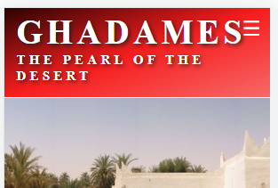

* Another issue was reported in the _iPhonSE_, that just a little of the event description text appeared and the remaining was covered by the image. This issue was solved by adjusting the text `Div` height.

  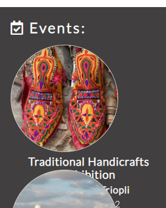

* A Desktop monitor user reported that there was an issue with the place of the Email label in the contact form as shown in the image. By changing the `display` property of the label the issue was fixed

  > 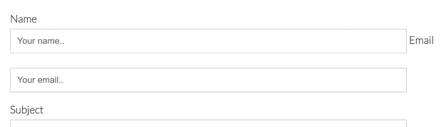

* When I tested the website on a mobile device and tablet, I noticed changes in the size of most content texts during screen orientation change, which cause a messy look for content. So, by Setting the `text size adjust` for all browsers to 100%, the issue was fixed.

   ```css
   html {
    -webkit-text-size-adjust: 100%;
    -moz-text-size-adjust: 100%;
    -ms-text-size-adjust: 100%;
    }
    ```
----

## 8. Deployment
  
* ### **Via Gitpod**
  
  The project code has been run in Gitpod using following steps:

  1. Install the Gitpod browser extension.
  
  1. Log into your Github account, then navigate to your project [Repository](https://docs.github.com/en/repositories).

  1. You will find a green Gitpod button has appeared.

  1. Press **Gitpod** button, you will direct to GitPod page.
  
  1. At the first time you need to authorize, so press **Authorize Gigpod**, then you will be directed to Create Account page.
  
  1. Click accept terms to start up your workspace in Gitpod.

* ### **Via GitHub Pages**
  
  The project was deployed via Github pages by using following steps:

  1. Log into your Github account.

  1. Navigate to the Repository, click the **Setting** button at the top menu.
  
  1. Click the **Pages** option, located on the left-side menu.
  
  1. Under **Source**, click the dropdown list titled "None", and select branch named "main". 
  
  1. Click **Save**. The site now deployed and the published site link will be created.

-----

## 9. Credits
 
 * ### **Content and Media** 
   
   * Content information and images are collected from many resourses such as: [UNESCO](https://whc.unesco.org/en/list/362/gallery/), [Wikipidia](https://https://en.wikipedia.org/wiki/Ghadames), [ResershGate](https://https://www.researchgate.net/publication/320176979_Interpretation_of_sustainable_desert_architecture_in_Ghadames_city_Libye), [Libya Adventures](https://libyaadventures.com/portfolio/ghadames/), [Aljazeera](https://www.aljazeera.com/gallery/2014/5/1/libyas-pearl-of-the-desert),
  [Islamic Architectural Heritage](https://www.islamicarchitecturalheritage.com/listings/old-town-of-ghadames), [Middle East Revised](https://middleeastrevised.com/2014/04/12/the-unique-houses-of-ghadames-libya/), [Wikimedia](https://commons.wikimedia.org/), and some other free copyright images can be found in Google. 

   * Burger menu for mobile devices follows a tutorial from
   [Tyler Potts](https://www.youtube.com/watch?v=kKRpeFk613I).

   * Image gallery style in gallery page follows a tutorial from [W3 Schools](https://https://www.w3schools.com/css/css_image_gallery.asp).

   * Linear gradients backgroung for header and footer follows CSS Gradients in [W3 Schools](https://www.w3schools.com/css/css3_gradients.asp).
  
   * Gallery video is embedded from [UNESCO You Tube channel](https://youtu.be/LCVldQzjyRY).

   * Setting text size adjust property solution in CSS file was taken from [stackoverflow](https://stackoverflow.com/questions/40892327why-is-font-size-changing-depending-on-portrait-or-landscape-for-mobile-devices).

   
 * ### **Acknowledgements**
 
   * I'm grateful to my mentor (Mr.Spence / Mr.Rohit) for helpful feedback.

   * Our facilitator (Kasia), and the student care team for their support.

   * Code institute slack is a good community that provides a lot of helpful information.

   