# Ghadames - Project Portfolio 1


## Table of contents
 
1. [Site Overview](#site-overview)

    +  [User Stories](#user-stories)

    + [Site Goals](#owner-goals)

1. [Features](#Website-Structure)

    +  [Header](#header)

    + [Home page](#home-page)

    + [Event section](#event-section)

    +  [Footer](#footer)

    + [About](#about)

    +  [Gallery](#gallery)

    + [Contact](#contact)

1. [Design](#design)
   
   + [Colours](#colours)

   + [Typography](#typography)

   + [Icons and Images](#icons-and-images)

1. [Testing and Validator](#testing-and-validator)
   
   + [Manual testing](#manual-testing)

   + [W3C Validator](#w3c-validator)

   + [Lighthouse DevTools](#lighthouse-devtools)

1. [Bugs and fixes](#bugs-and-fixes)
   
   + [Fixed Bugs](#fixed-bugs)

1. [Used technologies](#used-technologies)

1. [Deployment](#deployment)  

1. [Content and Media](#content-and-media)

1. [Credits](#credits)

------

## 1. Site Overview

 This site provides historic information about **Ghadames**, _The one of the oldest pre-Saharan cities_, known as ''`the pearl of the desert`''. And about **The old town** of Ghadames which has been declared in **1986** as a [UNESCO World Heritage site](https://whc.unesco.org/en/list/)</a>. 


#### [click here to view the site](https://amal-bb.github.io/Ghadames/)


### **User Stories**

* As a *first time visitor user*, I would like to easily understand the site purpose. 

 * As a *visitor user*, I would like to get knowledge of the most valuable information about Ghadames and its heritage town. 

 * As a *visitor user*, I would like to easily navigate through clear, organized, and attractive layout colors and images. 

 * As a *visitor user*, I would like to view a city gallery contain a short video, and clear images.

 * As an *intersting and frequent visitor user*, I want to find all upcoming events dates and locations.

 * As an *intersting visitor user*, I want to see the location of the city in the google map.

 * As an *intersting visitor user*, I would like to be able to contact the site owner to get help for arranging my visit to the city or for any other enquiries.


### **Site Goals**

 * Introduce Ghadames, its civilization, and its heritage. 

 * Show the historic information about Ghadames and the old town in an interesting way.

 * Provide users who are interesting to visit the city with important info related to a city location, culture, and weather. 

 * keep users up to date with any upcoming events for Ghadames.

 * Help users to plan their visit through a contact page.

 * Display a gallery of the most attractive places in the city that users can enjoy while visiting.

----

## 2. Features
  
* The website has been designed to be responsive on all devices sizes.

* Website header which contains the navigation bar stick to the top of the page while scrolling down.

* The navigation menu changed to a burger menu in small screen size devices.

   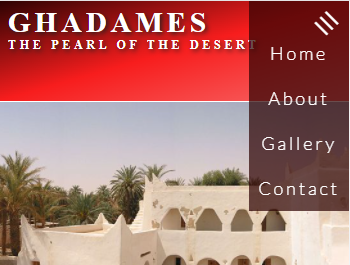

* The contact form in successful submits returns a confirmation message.

### **Header**
    

  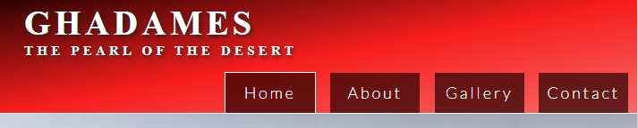

  * The header situated on the top of each page has a linear-gradient background color, contains the city logo on the left and the navigation bar on the right.
  
  * The logo very simply shows the city name using google font with a shadow, and it directs user to the home page in click on it.

  * The navigation bar is clear and easy to use contains 4 links: Home, About, Gallery, Contact.

   
  ### **Home page**

  * The first section contains the main image slide of the old town of Ghadames (_the heritage site of the city_).

  * The second section contains a brief introduction about Ghadames followed by three interesting headings with icons, including photos and short descriptions.

  * The last section is the Event section which displays upcoming events dates and locations with small circle images.

### **Footer**
  
  * It has the same linear gradient background color of the header, and It embedded Ghadames' location in Google Maps.

  * It contains icons direct to social media pages open in separate tabs, and another link direct to contact page.

### **About**

  * About page contains more detailed information about Ghadames, divided into two headings, history and the old town, attached with images.

### **Gallery**

  * A short video from the You Tube [channel of UNESCO](https://youtu.be/LCVldQzjyRY) has been embedded in the gallery page and some other photos with titles of description.

----

## 3. Design

### **Colours**

 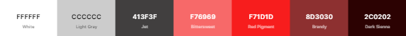

* Colors schema of gray and red has been used.

* The red color pattren inspired from the traditonal colors of Ghadames culture.

* This colours palette was generated at [Coolors](https://coolors.co/), and checked for contrast on [Contrast Grid](https://contrast-grid.eightshapes.com).

### **Typography**

Two fonts are used in the website.

* [**Lato**](https://fonts.google.com/specimen/Lato#about) is a sans serif typeface family,  imported from Google Fonts. It has been used for the body content. 

* **Serif** has been used for logo.

----

 ## 4. Used echnologies

 * Only `Html` and `CSS` languages are used in this project.

 * Website has been hosted through [GitHub](https://github.com/) . 

 * The multi device mockup was generated via [Techsini](http://techsini.com/multi-mockup/index.php) website. 
   
 * Images compression was done via [Toolur](https://compressimage.toolur.com).

----

   ## 5. Content and Media 
   
   * Content information and images are collected from many resourses like: [UNESCO](https://whc.unesco.org/en/list/362/gallery/), [Wikipidia](https://https://en.wikipedia.org/wiki/Ghadames), [ResershGate](https://https://www.researchgate.net/publication/320176979_Interpretation_of_sustainable_desert_architecture_in_Ghadames_city_Libye), [Libya Adventures](https://libyaadventures.com/portfolio/ghadames/), [Aljazeera](https://www.aljazeera.com/gallery/2014/5/1/libyas-pearl-of-the-desert),
  [Islamic Architectural Heritage](https://www.islamicarchitecturalheritage.com/listings/old-town-of-ghadames), [Middle East Revised](https://middleeastrevised.com/2014/04/12/the-unique-houses-of-ghadames-libya/), [Wikimedia](https://commons.wikimedia.org/), and some other free copyright images can be found in Google. 

   * Burger menu for mobile devices follows a tutorial from
   [Tyler Potts](https://www.youtube.com/watch?v=kKRpeFk613I).

   * Image gallery style in gallery page follows a tutorial from [W3 Schools](https://https://www.w3schools.com/css/css_image_gallery.asp).

   * Linear gradients backgroung for header and footer follows CSS Gradients in [W3 Schools](https://www.w3schools.com/css/css3_gradients.asp).
  

   * Gallery video is embedded from [UNESCO You Tube channel](https://youtu.be/LCVldQzjyRY).

   * [Google Font](https://developers.google.com/fonts) is impotred to use for content font.

   * Icons used in this project are imported from [Font Awesome](https://kit.fontawesome.com).

----

 ## 5. Testing and Validtor

 * The responsivness view test for the site has been tested in a range of screen sizes via [Chrome DevTools](https://developer.chrome.com/docs/devtools/).

 * The website has been tested in desktop browsers **Chrome** and **Firefox**, also has been shared with other users to get testing in many different devices like: _Iphon8, IphonSE, Iphon12, Nokia 2.3, Huawei, Galaxy A12 and Tablet_.

 * The final testing result after solving bugs was the site has responsive view, and works fine with no issues reported.


 ### **Test Cases**

 * When user of mobile device click on burger menu then the burger lines will rotate and navigation menu will appear, once he click again navigation menu will disappear and buger lines return to thier first position.

 * If user press submit button on contact page without filling any of required field (Name or Email), then warning message will appears in this fields.

   > 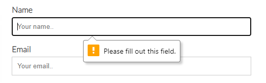
 
 * If user fills the Name by one letter, or in case of typing incorrect email another warning message will appears in this fields.

   > 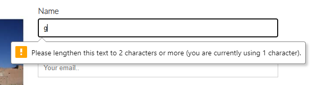
 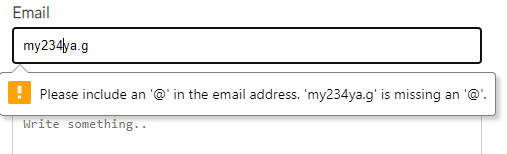
 
 * Once user fills all required field and then press submit button, he will get confirmation message.

    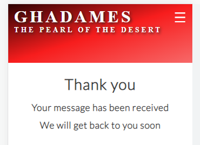


### **Code Validation**

 * No errors were returned for `Html Code` when passing site URI through the offical [W3C Validator](https://validator.w3.org/).

 * No errors were returned for `CSS Code` when passing site URI through the offical [Jigsaw Validator](https://jigsaw.w3.org/css-validator/). 

 * Project **Accessibility** has been checked through [Lighthouse](https://developers.google.com/web/tools/lighthouse) in Chrome DevTools, the result is shown below for both mobile and desktop.

   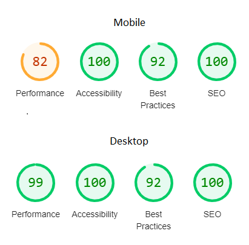

## 6. Bugs and Fixing

All reported bugs from testing has been fixed.

### **Fixed Bugs**

* By tesing the website in small screen devices, the burger menu wasn't appear clear as it was close to the logo side, This issue was addressed by reducing logo `font size` and `padding` properties in style sheet for screens of maximum width 490 pixels.

  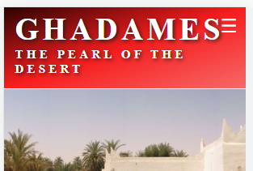

* Another issue was reported in the small screen devices, that just a littel of the event description text was appeared and other text was covered by the image. This issue was solved by adjusting the text `Div` height.

  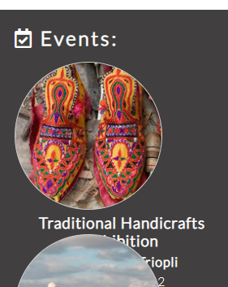

* A Desktop moniter user reported that there was an issue of the place of Email label in contact form as shown in the image. By changing the `display` property of the label the issue was fixed.

  > 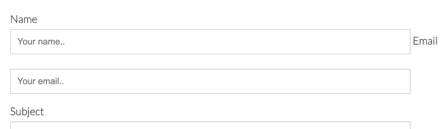

* When I tested the website in mobile devices and tablet, I noticed that most of the content texts sizes change during screen orientation change. So, by Set the `text size adjust` for all browsers to 100%, the issue was fixed.
   ```css
   html {
    -webkit-text-size-adjust: 100%;
    -moz-text-size-adjust: 100%;
    -ms-text-size-adjust: 100%;
    }
    ```
------

## 7. Deployment
 
 ### **Via GitHup**
  
  The project was deployed via Githup pages by using following steps:

  1. Log into your Githup account.
  1. Navigate to the [Repository](https://docs.github.com/en/repositories), click the `Setting` button at the top menu.
  1. Click the `Pages` option, located on the left-side menu.
  1. Under `Source`, click the dropdown list titled "**None**", and select branch named "**main**". 
  1. Click `Save`. The site now deployed and the published site link will be created.

   