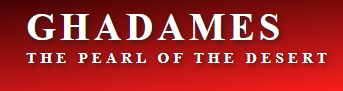
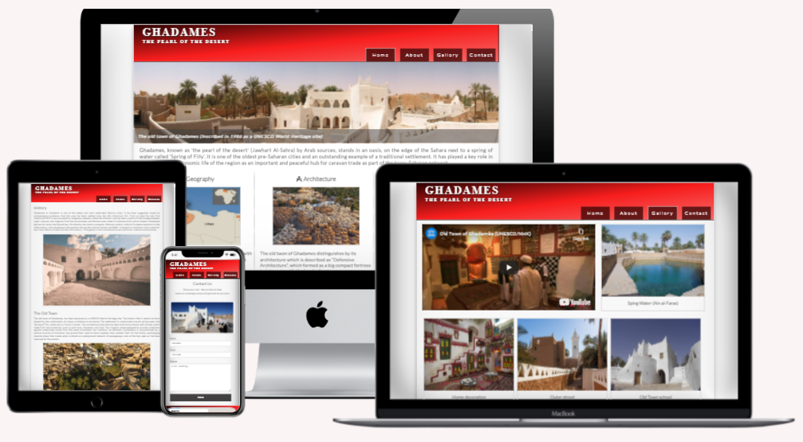
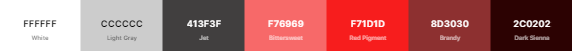
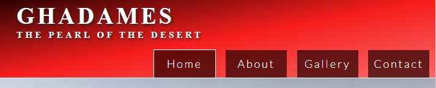
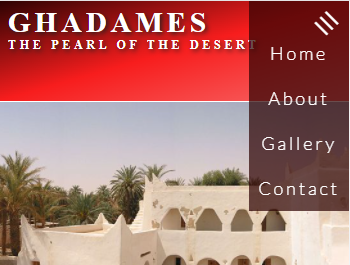

# Ghadames - Project Portfolio 1


## Table of contents
 
1. [Site Overview](#site-overview)

    +  [User Stories](#user-stories)

    + [Site Goals](#site-goals)

1. [Features](#features)

    +  [Header](#header)

    + [Home page](#home-page)

    +  [Footer](#footer)

    + [About](#about)

    +  [Gallery](#gallery)

    + [Contact](#contact)

1. [Design](#design)
   
   + [Colours](#colours)

   + [Typography](#typography)

1. [Testing and Validator](#testing-and-validator)
   
   + [Code Validator](#code-validator)

   + [Test Cases](#test-cases)

1. [Bugs and fixes](#bugs-and-fixes)
   
   + [Fixed Bugs](#fixed-bugs)

1. [Used Technologies](#used-technologies)
  
1. [Content and Media](#content-and-media)

1. [Deployment](#deployment)
  
   + [Via Gitpod](#via-gitpod)

   + [Via GitHub Pages](#via-github-pages)

1. [Credits](#credits)

------

## 1. Site Overview

 This site provides historic information about **Ghadames**, _The one of the oldest pre-Saharan cities_, known as ''**the pearl of the desert**''. And about **The old town** of Ghadames which has been declared in *1986* as a [UNESCO World Heritage site](https://whc.unesco.org/en/list/)</a>. 


#### [click here to view the site](https://amal-bb.github.io/Ghadames/)


+ ### **User Stories**
 
  As a *visiting user*, I would like to:
 
     * Get knowledge of the most valuable information about Ghadames and its heritage town.  

     * View a city gallery contain a short video, and clear images.

     * Find all upcoming events dates and locations.

     * See the location of the city in the google map.

     * Contact the site owner to get help for arranging my visit to the city or for any other enquiries.


+ ### **Site Goals**

      * Introduce Ghadames, its civilization, and its heritage. 

      * Show the historic information about Ghadames and the old town in an interesting way.

      * Provide users who are interesting to visit the city with important info related to a city location, culture, and weather. 

      * keep users up to date with any upcoming events for Ghadames.

      * Help users to plan their visit through a contact page.

      * Display a gallery of the most attractive places in the city that users can enjoy while visiting.

----
## 2. Design

+ ### **Colours**

    

    * Colours schema of gray and red has been used.

+ ### **Typography**

   * [**Lato**](https://fonts.google.com/specimen/Lato#about) font is a sans serif typeface family, used throughout the whole website with Sans Serif as the fallback font in case of the font isn't being imported into the site correctly.

   * Serif has been used for the logo. 

   * Both fonts are clear, attractive and appropriate.

+ ### **Imagery**

   * The red color pattren inspired from the traditonal colors of Ghadames culture.
   
   * The subtitle of the city name logo used to get user inquisitiveness to find out more about the city.

----

## 3. Features
  
* The website has been designed to be responsive on all device sizes.

+ ### **Header**

    * The header situated on the top of each page has a attractive linear-gradient background color, contains the city logo on the left and the navigation bar on the right.

    * It stick to the top of the page while scrolling down to make navigation more easy for users.
  
    * The logo is very simply shows the city name using clear font styled with a shadow, and it linkes to home page.

      

+ ### **Navigation Bar**

    * The navigation bar is clear and easy to use contains 4 links: Home, About, Gallery and Contact.

    * The navigation bar will allow the user to easily navigate from page to page across all devices, as the navigation menu is changed to a burger menu in small screen size devices.

      
   
+ ### **Home page**

  The Home page has a valuable content that should encourage a visiting user to navigate to other pages to know more about Ghadames. 

    *  _**Image section**_: has an attractive view photo for the old town of Ghadames (_the heritage site of the city_), with text overlay of short decription to get user attantion, and get his intersting to know more about the place.

     * _**Content section**_: contains a brief introduction of the most intersting information about Ghadames followed by three main headings with icons, including images and short descriptions.

        [Home Page](readme-images/home-page.PNG)

    * _**Event section**_: this section will allow the user to see the city event type, date and location. It displays the event with small image, and will be updated to keep users up to date with upcoming events.

      [Event section](readme-images/event-section.PNG)

+ ### **Footer**
  
    * It has the same linear gradient background color of the header, and It include an embedded Google Map for Ghadames location.

    * It contains icons direct to social media pages open in separate tabs, and another link direct to contact page.

    * The footer is valuable to the user as it encourages him to get in contact to plan his visit.

       [Footer](readme-images/footer.PNG)

+ ### **About**

     * About page gives users more detailed information about Ghadames, divided into two headings, history and the old town, attached with images.

      [About page](readme-images/about-page.PNG)

+ ### **Gallery**

    * This page provides the user with a short video showing the heritage places and describes the history of Ghadames, with supporting images of attractive places to visit.
  
    * This section will get the user excited to visit those places
    
      [Gallery page](readme-images/gallery-page.PNG)

+ ### **Contact**

    * This page will allow the user to get in contact with site owner. He can get a help to plan his visit, or to get response for his enquiries, as he will get a confirmation message on successful submission.

      [Contact](readme-images/contact-page.PNG)

----

## 3. Future Features

   * I would use javascript to create an image slideshow instead of the main image on the Home page to make it more attractive and easily catching the user's attention.

   * I would add an Email subscribe option to keep users updated with city events. 

---

## 4. Used Technologies

  * Only `Html` and `CSS` languages are used in this project.

  * Website has been hosted through [GitHub](https://github.com/) . 

  * The multi device mockup (_The image attatched here in readme_) was generated via [Techsini](http://techsini.com/multi-mockup/index.php) website. 
   
 * Images compression was done via [Toolur](https://compressimage.toolur.com).

 * Colours palette was generated at [Coolors](https://coolors.co/), and checked for contrast on [Contrast Grid](https://contrast-grid.eightshapes.com).
 
----

 ## 5. Testing and Validtor

 * The responsivness view test for the site has been tested in a range of screen sizes via [Chrome DevTools](https://developer.chrome.com/docs/devtools/).

 * The website has been tested in desktop browsers **Chrome** and **Firefox**, also has been shared with other users to get testing in many different devices like: _Iphon8, IphonSE, Iphon12, Nokia 2.3, Huawei, Galaxy A12 and Tablet_.

 * The final testing result after solving bugs was the site has responsive view, and works fine with no issues reported.

### **Code Validation**

 * No errors were returned for `Html Code` when passing site URI through the offical [W3C Validator](https://validator.w3.org/).

 * No errors were returned for `CSS Code` when passing site URI through the offical [Jigsaw Validator](https://jigsaw.w3.org/css-validator/). 

 * Project **Accessibility** has been checked through [Lighthouse](https://developers.google.com/web/tools/lighthouse) in Chrome DevTools, the result is shown below for both mobile and desktop.

   


 ### **Test Cases**

 * When user of mobile device click on burger menu then the burger lines will rotate and navigation menu will appear, once he click again navigation menu will disappear and buger lines return to thier first position.

 * If user press submit button on contact page without filling any of required field (Name or Email), then warning message will appears in this fields.

   > 
 
 * If user fills the Name by one letter, or in case of typing incorrect email another warning message will appears in this fields.

   > 
 
 
 * Once user fills all required field and then press submit button, he will get confirmation message.

    


## 6. Bugs and Fixing

All reported bugs from testing has been fixed.

### **Fixed Bugs**

* By tesing the website in small screen devices, the burger menu wasn't appear clear as it was close to the logo side, This issue was addressed by reducing logo `font size` and `padding` properties in style sheet for screens of maximum width 490 pixels.

  

* Another issue was reported in the small screen devices, that just a littel of the event description text was appeared and other text was covered by the image. This issue was solved by adjusting the text `Div` height.

  

* A Desktop moniter user reported that there was an issue of the place of Email label in contact form as shown in the image. By changing the `display` property of the label the issue was fixed.

  > 

* When I tested the website on a mobile device and tablet, I noticed changes in the size of most content texts during screen orientation change, which cause a messy look for content. So, by Setting the `text size adjust` for all browsers to 100%, the issue was fixed.

   ```css
   html {
    -webkit-text-size-adjust: 100%;
    -moz-text-size-adjust: 100%;
    -ms-text-size-adjust: 100%;
    }
    ```
------

   ## 5. Content and Media 
   
   * Content information and images are collected from many resourses like: [UNESCO](https://whc.unesco.org/en/list/362/gallery/), [Wikipidia](https://https://en.wikipedia.org/wiki/Ghadames), [ResershGate](https://https://www.researchgate.net/publication/320176979_Interpretation_of_sustainable_desert_architecture_in_Ghadames_city_Libye), [Libya Adventures](https://libyaadventures.com/portfolio/ghadames/), [Aljazeera](https://www.aljazeera.com/gallery/2014/5/1/libyas-pearl-of-the-desert),
  [Islamic Architectural Heritage](https://www.islamicarchitecturalheritage.com/listings/old-town-of-ghadames), [Middle East Revised](https://middleeastrevised.com/2014/04/12/the-unique-houses-of-ghadames-libya/), [Wikimedia](https://commons.wikimedia.org/), and some other free copyright images can be found in Google. 

   * Burger menu for mobile devices follows a tutorial from
   [Tyler Potts](https://www.youtube.com/watch?v=kKRpeFk613I).

   * Image gallery style in gallery page follows a tutorial from [W3 Schools](https://https://www.w3schools.com/css/css_image_gallery.asp).

   * Linear gradients backgroung for header and footer follows CSS Gradients in [W3 Schools](https://www.w3schools.com/css/css3_gradients.asp).
  

   * Gallery video is embedded from [UNESCO You Tube channel](https://youtu.be/LCVldQzjyRY).

   * [Google Font](https://developers.google.com/fonts) is impotred to use for content font.

   * Icons used in this project are imported from [Font Awesome](https://kit.fontawesome.com).

----
## 7. Deployment
  
  ### **Via Gitpod**
  
  The project code has been run in Gitpod using following steps:

  1. Install the Gitpod browser extension.
  
  1. Log into your Github account, then navigate to your project [Repository](https://docs.github.com/en/repositories).

  1. You will find a green Gitpod button has appeared.

  1. Press **Gitpod** button, you will direct to GitPod page.
  
  1. At the first time you need to authorize, so press **Authorize Gigpod**, then you will be directed to Create Account page.
  
  1. Click accept terms to start up your workspace in Gitpod.

 ### **Via GitHub Pages**
  
  The project was deployed via Github pages by using following steps:

  1. Log into your Github account.

  1. Navigate to the Repository, click the **Setting** button at the top menu.
  
  1. Click the **Pages** option, located on the left-side menu.
  
  1. Under **Source**, click the dropdown list titled "None", and select branch named "main". 
  
  1. Click **Save**. The site now deployed and the published site link will be created.


## 7. Credits

  * I'm grateful to my mentor (Mr.Spence / Mr.Rohit), our facilitator (Kasia), and the student care team for their support.

  * Code institute slack is a good community provides a lot of helpful information.

   