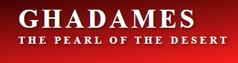
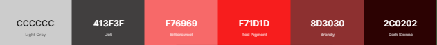

# Ghadames - Project Portfolio 1

## Table of contents
 
1. [Site Overview](#site-overview)

    i.  [User Stories](#user-stories)

    ii. [Site Goals](#owner-goals)

2. [Features](#Website-Structure)

    i.  [Header](#header)

    ii. [Home page](#home-page)

    iv. [Event section](#event-section)

    v.  [Footer](#footer)

    vi. [About](#about)

    vii. [Gallery](#gallery)

    viii.[Contact](#contact)

3. [Design](#design)
   
   i. [Colours](#colours)

   ii. [Typography](#typography)

   iii. [Icons and Images](#icons-and-images)

4. [Testing and Validator](#testing-and-validator)
   
   i. [Manual testing](#manual-testing)

   ii. [W3C Validator](#w3c-validator)

   iii. [Lighthouse DevTools](#lighthouse-devtools)

5. [Bugs and fixes](#bugs-and-fixes)

6. [Deployment](#deployment)

7. [Used technologies](#used-technologies)
   
   i. [Languages](#languages)

   ii. [Content](#content)

   iii. [Media](#media)

8. [Credits](#credits)

------

## 1. Site Overview

 This site provides historic information about **Ghadames**, _The one of the oldest pre-Saharan cities_, known as ''`the pearl of the desert`''. And about **The old town** of Ghadames which has been declared in **1986** as a <a href="https://whc.unesco.org/en/list/" target="_blank">UNESCO World Heritage site</a>. 

#### <a href="https://amal-bb.github.io/Ghadames/" target="_blank"> click here to view the site </a>

### **User Stories**

. As a first time visitor user, I would like to easily understand the site purpose. 

 . As a visitor user, I would like to get knowledge of the most valuable information about Ghadames and its heritage town. 

 . As a visitor user, I would like to easily navigate through clear, organized, and attractive layout colors and images. 

 . As a visitor user, I would like to view a city gallery contain a short video, and clear images.

. As an intersting and frequent visitor user, I want to find all upcoming events dates and locations.

 . As an intersting visitor user, I want to see the location of the city in the google map.

 . As an intersting visitor user, I would like to be able to contact the site owner to get help for arranging my visit to the city or for any other enquiries.

### **Site Goals**

. Introduce Ghadames, its civilization, and its heritage. 

 . Show the historic information about Ghadames and the old town in an interesting way.

 . Provide users who are interesting to visit the city with important info related to a city location, culture, and weather. 

 . keep users up to date with any upcoming events for Ghadames.

 . Help users to plan their visit through a contact page.

 . Display a gallery of the most attractive places in the city that users can enjoy while visiting.

----

 ## 2. Features
  
  . The website has been designed to be responsive on all devices sizes.

. Website header which contains the navigation bar stick to the top of the page while scrolling down.

. The navigation menu changed to a burger menu in small screen size devices.

. The contact form in successful submits returns a confirmation message.

  ### **Heading**
    
  . The heading situated on the top of each page has a linear-gradient background color, contains the city logo on the left and the navigation bar on the right.

  . The logo very simply shows the city name using google font with a shadow, and it directs user to the home page in click on it.

  . The navigation bar is clear and easy to use contains 4 links: Home, About, Gallery, Contact.

   
  ### **Home page**

  . The first section contains the main image slide of the old town of Ghadames (the heritage site of the city).

  . The second section contains a brief introduction about Ghadames followed by three interesting headings with icons, including photos and short descriptions.

  . The last section is the Event section which displays upcoming events dates and locations with small circle images.

### **Footer**
  
  . It has the same linear gradient background color of the header, and It embedded Ghadames' location in Google Maps.

. It contains icons direct to social media pages open in separate tabs, and another link to the contact page.

### **About**

  . About page contains more detailed information about Ghadames, divided into two headings, history and the old town, attached with images.

### **Gallery**

  . A short video from the You Tube<a href="https://youtu.be/LCVldQzjyRY" target="_blank"> channel of UNESCO</a> has been embedded in the gallery page and many other photos with titles.

----

## 3. Design

### **Colours**

. Colors schema of gray and red has been used.

. The red pattren color inspired from the traditonal colors of Ghadames culture.

### **Typography**

Two fonts are used in the website.

. <a href="https://fonts.google.com/specimen/Lato#about" target="_blank">**Lato** </a> is a sans serif typeface family,  imported from Google Fonts. It has been used for the body content. 

. **Serif** has been used for logo.
